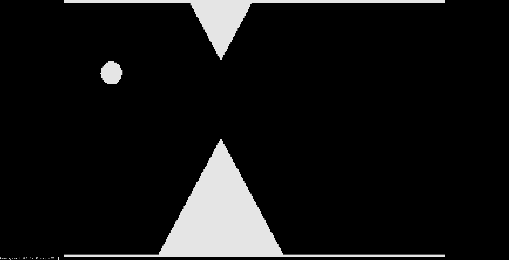
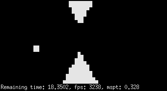
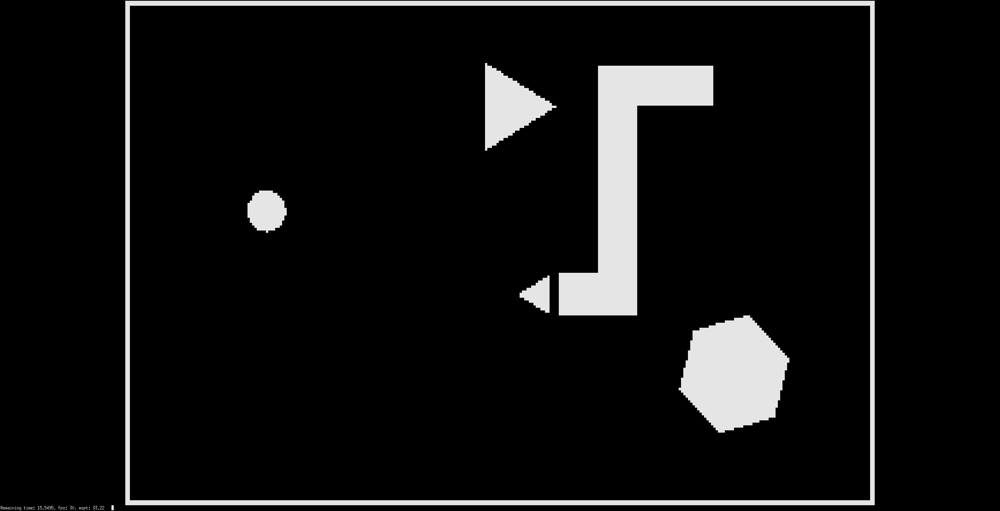
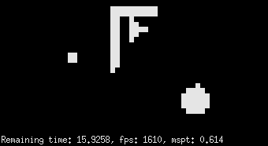
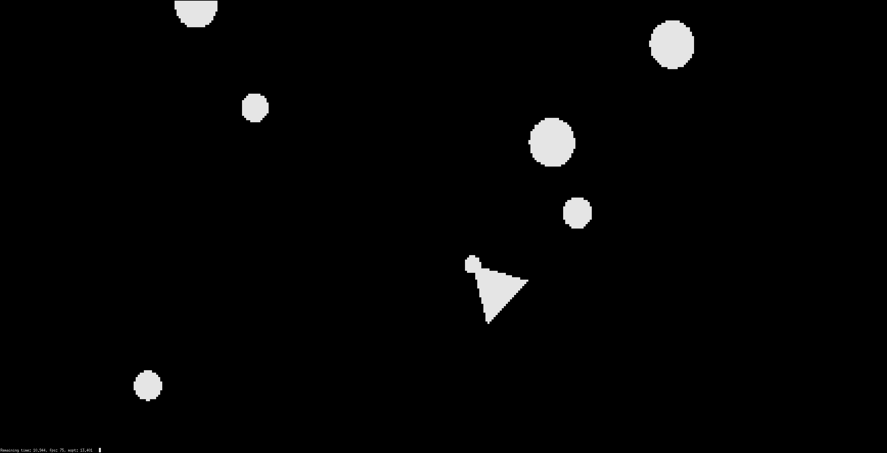
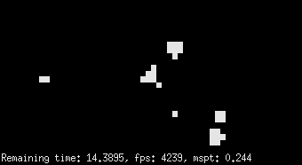
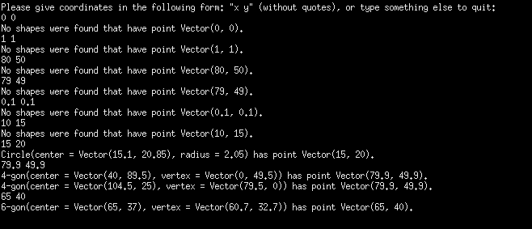
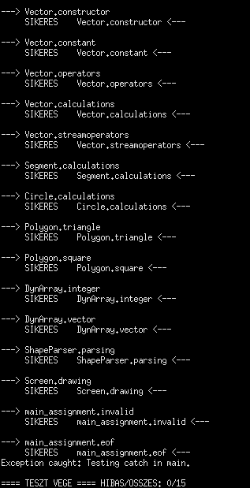

# Gameotry
C++ homework that calculates simple shape collisions, and some games made with them.

Nézd meg a sajátkezű [dokumentációt](documentation/documentation.md), vagy a [teljeset](documentation/merged.pdf), amelyikben a Doxygen által generált osztályleírások is benne vannak.

3 féle játékot készítettem, mind nagyon egyszerűek és fapadosak, viszont a program felépítése miatt terminálfelbontás-függetlenül működnek.

Flappy Bird:

Snake:

Asteroids:

Illetve a feladat által kért benne-van-e-valamelyik-alakzatban-a-pont típusú feladat, a kígyós pályára:

És tesztek is vannak:

[Köszönöm](https://unique-names.com/word-mixer.php) a név ötletet 😀.
