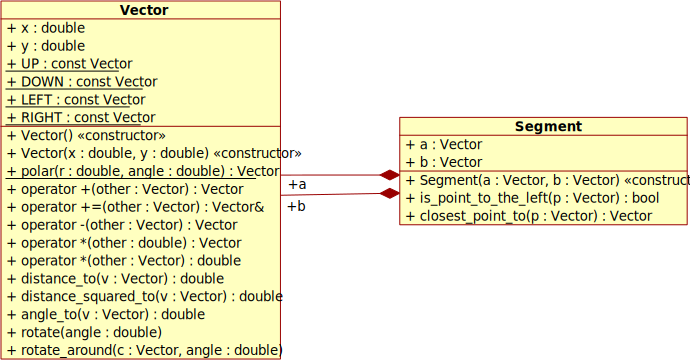
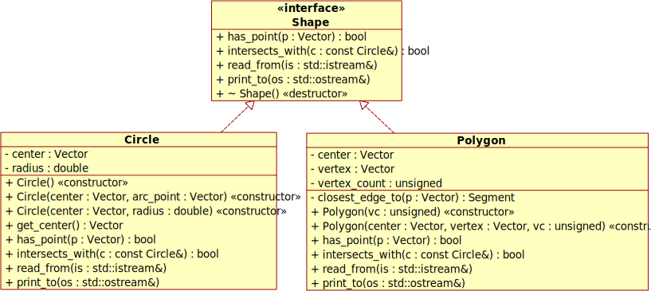
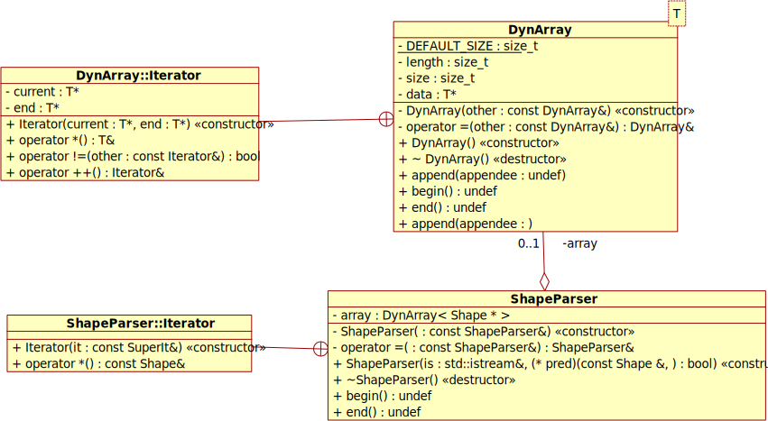

# Adatok

Ezt a programot a BME mérnökinformatikus képzés Programozás alapjai 2. tárgyának nagy házi feladataként készítem.

A program standard C++-ban íródik (C++ 11-nek megfelelően), de opcionálisan használja a tárgy anyagából szerzett (és kibővített) Console osztályt, ami nem standard C++, de jobb parancssori élményt nyújt, és az interfésze jól definiált.

# Specifikáció

## Választott feladat szövege

**Síkidomok**

Készítsen absztrakt síkidom-osztályt, és valósítson meg segítségével szabályos háromszöget, négyzetet és kört! Ezen síkidomokat középpontjuk és egy csúcsuk (kör esetén a körvonal egy pontja) határozza meg, amelyek kétdimenziós koordinátákként olvashatóak be egy istream típusú objektumról. A síkidomoknak legyen olyan metódusa, amellyel eldönthető, hogy egy adott pont a síkidom területére esik-e! Legyen továbbá olyan metódusuk is, ami megadja, hogy tartalmazza-e azokat egy adott sugarú, origó középpontú kör!

Írjon főprogramot, amely egy fájlból {típus, középpont, csúcs} tartalmú sorokat olvas be (az istream >> síkidom operátor felhasználásával)! A beolvasott síkidomok közül azokat tárolja el (heterogén kollekció), amelyek teljes terjedelmükben az origó középpontú egységkörön kívül esnek. Ezután koordinátákat olvasson be a szabványos bemenetről a fájl végéig, és írja ki az egyes pontokhoz azon eltárolt síkidomok adatait (név, középpont, csúcs), amelyek az adott pontot tartalmazzák. A megoldáshoz **ne** használjon STL tárolót!

## Feladat pontosítása

Jobbnak tartottam a szabályos háromszög és négyzet osztályokat egybevonni egy n csúcsú szabályos sokszög osztályba, ezáltal a program sokkal általánosabb, minimális többletproblémával.

Szintén jobbnak találtam, ha az origó középpontú egységkör helyett egy bármilyen, általános, kör típusú objektumról képes eldönteni a síkidom (mindkét fajta), hogy van-e a körrel közös pontja.

A beolvasáskor lehetőség lesz szűrni, hogy mely síkidomok tárolódjanak el, így az egységkörön kívül esésre való szűrés beolvasás alatt, a feladat szövegének megfelelően, megtörténhet.

## Bemeneti fájlformátum

A fájlból beolvasás a következő formátumban történik:

```
típus (uint)
középpont (double double)
csúcs (double double)
... és ezek ismétlése
```

például:

```
4 40 -39.5 0  0.5
4 40  89.5 0 49.5

4 -24.5 25 0.5 0
4 104.5 25 79.5 0

0 15.1 20.85 15.1 22.9
3 41 10.5 46 10.5
6 65 37 60.7 32.7
```

Ahol a típus = 0 kört jelöl, a típus >= 3 szabályos n-szöget, a típus = 1 vagy 2 pedig érvénytelen formátum.

Bármilyen, uintként (a típus helyén) vagy double-ként (a koordináták helyén) nem értelmezhető bemenet is érvénytelen formátum.

Érvénytelen formátum esetén a főprogram hibaüzenettel kilép.

A fájl végén amennyiben egy alakzat beolvasása folyamatban van (azaz 5-tel nem osztható számú szám van a fájlban), akkor az utolsó, befejezetlen alakzat nem lesz beolvasva, hibaüzenet nélkül.

A sortörés és szóköz felcserélhető, a lényeg a whitespace a számok között.

A szabványos bemeneten kapott (double double) koordinátákra is hasonlóak igazak.

## Kimeneti formátum

A síkidomok adatainak kiírása az alábbi formátumban történik, ez a konkrét példa megfelel a fentebbi bemenet-példának:

```
4-gon(center = Vector(40, -39.5), vertex = Vector(0, 0.5))
4-gon(center = Vector(40, 89.5), vertex = Vector(0, 49.5))
4-gon(center = Vector(-24.5, 25), vertex = Vector(0.5, 0))
4-gon(center = Vector(104.5, 25), vertex = Vector(79.5, 0))
Circle(center = Vector(15.1, 20.85), radius = 2.05)
3-gon(center = Vector(41, 10.5), vertex = Vector(46, 10.5))
6-gon(center = Vector(65, 37), vertex = Vector(60.7, 32.7))
```

Tehát a kör esetén a körív pont koordinátái helyett a sugarat fogja kiírni.

## Kiegészítés játékká

A feladatot továbbgondolva lehessen a síkidomokat felhasználni egyszerű, parancssori játékok készítéséhez, ehhez a következő kiegészítésekre van szükség:

- a tárgyhoz készített Console osztályra (`console.h` és `console.cpp`), a [4. heti laborról](https://git.ik.bme.hu/Prog2/labor_peldak/lab_04/tree/master)
- egy osztályra, ami képes [doboz karakterekké](https://en.wikipedia.org/wiki/Block_Elements) alakítani a síkidomot, majd kirajzolni azt a képernyőre, felhasználva a síkidom metódusait
- egy `Game` absztrakt osztályra, aminek van két felülírandó metódusa: az `input` és az `update`
- játékokra, amik felhasználják ezeket a lehetőségeket: például Flappy Bird, vagy Snake
- egy alternatív főprogramra, ami a játékokat indítja a koordináta-beolvasás helyett

A Snake veheti a pályát egy fájlból a fentebb leírt formátumban, emiatt is kell a beolvasást általánosítani (hogy az egységkörre való szűrés predikátummal történjen).

A játékok egyszerűek, és sok minden közös bennük:

- adott ideig kell túlélni (pl. 10 másodperc)
- ennyi idő után egy másik játék jön
- az egyetlen score az egy huzamban játszott játékok száma, ezt a játék végén megjeleníti, de nem menti el
- az irányítás nyilakkal (vagy wasd-dal) történik, `q` karakterrel pedig kilép a játékos

## Tesztek

A vektor, szakasz, kör és sokszög osztályok mindenféle számokkal jól tesztelhetők, megpróbálok minden esetet lefedni velük.

A dinamikus tömb sablonnál minimális implementációra törekszem, a lehető legkevesebb függvényt írom meg, hogy csökkentsem a hibalehetőséget és a tesztelendő kódot. A megírt függvényeket viszont teljesen le szeretném fedni, int és saját típusú példányokon futtatott tesztekkel.

A fájlból beolvasó osztályt tesztfájl beolvasásával tudom a legjobban tesztelni, hibás formátumú fájl is lesz.

A dobozrajzoló osztálynál a generált ábrát lehet stringként összehasonlítani a várttal.

A feladatban szereplő főprogramot egyben is lehet tesztelni, beolvastatni vele a fájlt, és várni a kiírt síkidomokat a koordinátákra válaszul.

A konzol osztályt, a játék osztályokat és a játék főprogramot nem tervezem tesztelni, mert túl nehéz volna platformfüggő, illetve eltelt időtől függő teszteket írni.

## Módosítások az 1. verzióhoz képest

A bemeneti fájlformátumban mégsem lesz hibajelzés váratlanul véget érő fájl esetén (nem 5-tel osztható számú számot tartalmazó bemenetnél).

Az egységkörön belül levésre való szűrés mégis megtörténhet beolvasás alatt, eltárolás előtt, predikátummal.

Használt teszt keretrendszerek (memtrace és gtest_lite): [innen](https://git.ik.bme.hu/Prog2/ell_feladat/Test).

# Terv

## Osztálydiagramok

### Vektor és Szakasz

A többi osztály alap építőköve a Vektor (irányított szakasz, 2D-s, nem dinamikus tömb!).

A szabályos sokszögeknél pedig könnyű volt szakaszhoz tartozó számításokat elkülöníteni, úgyhogy amellett döntöttem, hogy legyen ez egy külön struct-ban.

Mivel ezeknek a struktúráknak semmilyen invarianciája nincs, ezért nyugodtan lehet kívülről belenyúlni az adattagokba, nyugodtan lehetnek publikusak. Inkább csak adat, és egy pár rájuk értelmezett függvény laza kapcsolatáról van szó.

Hasonlóan a beépített típusokhoz, ezeket általában érték szerint adjuk át.



### Alakzatok

A feladat lényegi osztályai. A feladatnak megfelelően absztrakt ősosztályból származnak.

Meggondolandó, hogy a `center: Vector` tagváltozó a közös ősben legyen-e; ennek esetleg akkor lehetne értelme, ha szükség volna eltolás függvényre, ezt akkor egyszerűbb lenne általánosan implementálni a közös ősre (és így a leszármazottaknak csak relatív pozíciót volna szabad tárolni). Viszont nem kell eltolás funkció, ekkor átláthatóbb, ha az ősosztályban nincs semmilyen adattag, sem nem tisztán virtuális tagfüggvény; és inkább, mint egy interfészként/trait-szerűségként használom az örökést.

Megjegyzendő, hogy a Circle-nél a default konstruktor, illetve a Polygon-nál az egy int-tet (vertex count-ot) fogadó konstruktor, memóriaszeméttel inicializálják az adattagokat. Ez abból az elgondolásból van, hogy miért legyen a (0,0) középpontú kör (bal felső sarok) alapértelmezettebb, mint a (40,25) középpontú (az van a képernyő közepén a Screen osztálynak megfelelően - de erről ez az oszály nem is kell, hogy tudjon).

Ilyen konstruktorra egyáltalán azért van csak szükség, hogy `istream`-ből `>>` operátorral ki lehessen olvasni az adatot, ami így a memóriaszemét helyére amúgy is bekerül. Hogyha nem kellene ilyen módon beolvasni, akkor valahogyan máshogy, például egy függvény visszatérési értékeként adnám vissza az objektumot a beolvasás eredményeként, és nem referenciaként kapná meg a függvény. Ezzel a módszerrel teljesen elkerülhető volna a nem megfelelő állapotban (akár memóriaszemetet, akár valami programozó által megadott véletlenszerű számot tartalmazó állapotban) levő objektum.

Az `istream` és az `ostream` `>>` illetve `<<` túlterhelt operátora a `Shape` `read_from` illetve `print_to` függvényeit hívja meg, így elkerülve a mindenféle függvényekre történő szülő/gyerek illesztési sarokeseteket.



### Dinamikus tömb és Alakzatbeolvasó

A sablon dinamikus tömb, és az őt használó alakzatbeolvasó osztály.

Mindkettőn lehet iterálni: az iterátoroknál (mint sok helyen máshol is), a minimális működő implementációra törekedtem, mert minél kevesebb kód, annál kevesebb hiba és teszt. Így az iterátoroknál csak a postfix `operator++`-t, a dereferáló operátort és az `operator!=`-t implementáltam, ez, ha minden igaz, [elég kell legyen](https://en.cppreference.com/w/cpp/language/range-for) a standard C++11-ben használható új for loop használatához. (Tehát nincs `op--`, postfix `op++`, `op->`, sem `op==`.)

Az alakzatbeolvasó osztály tagjait jelenleg csak az iterátoron keresztül lehet elérni, de ez úgy tűnik, elég a szükséges feladatokhoz. Úgy tűnik, a dinamikus tömb indexelésére és hosszlekérdező függvényére sincs szükség (elemet törölni amúgy sem lehetséges), ezért lehet, hogy azok helyett is elég az iterátor az elemek eléréséhez.

A másoló konstruktor és az értékadás operátor mindkét osztály esetén le van tiltva, a beépített nem megfelelő, sajátra pedig nincs szükség.

Az alakzatok beolvasása a `ShapeParser` konstruktorában történik, az alakzatok delete-elése pedig a destruktorban, más pedig nem is férhet hozzá a dinamikus memóriára mutató pointerekhez, így könnyebben átlátható, hogy nem lesznek memóriakezelési bakik.

Ennek hátulütője, hogy meglehetősen nehéz a konstruktorban megadott input streamet egy `ShapeParser`-t tartalmazó objektum (pl. `GameSnake`) konstruktorában megadott fájlra mutató `ifstream`-mel inicializálni, majd még az esetleges hibát is lekezelni (megnézni, hogy az `ifstream` elérte-e a fájl végét, akkor sikeres a beolvasás), mindezt az inicializáló listán belül. Úgyhogy ennek kezelése sajnos a főprogram problémája lesz: meg kell nyitnia a streamet, átadni a `GameSnake`-nek, majd leellenőriznie, hogy sikeres volt-e a beolvasás.

A `ShapeParser` iterátora lényegében ugyanaz, mint az `array` adattagjának iterátora, csak még egyszer dereferálja a `DynArray` iterátora által visszaadott értéket, így nem `Shape*`-okon lehet iterálni, hanem `const Shape&`-eken, hogy egyértelmű legyen a felelősség a dinamikus memóriáért (illetve const, mert nincs is értelme a `ShapeParser`-ben levő beolvasott adatokat megváltoztatni).



### Konzol és Képernyő

Segédosztályok, a játékok megvalósításához.

A `Console` osztály a [4. heti laborról](https://git.ik.bme.hu/Prog2/labor_peldak/lab_04/tree/master) származik, kiegészítve a `kbhit` és a `getsize` metódusokkal (ehhez Linuxon szükség van a `<sys/ioctl.h>` include-olására és használatára, Windowson nem szükséges extra függőség hozzájuk). Ez az osztály nem lesz szükséges a feladat által kiírt főprogram, illetve a tesztprogram fordításához, csak a játékokat tartalmazó főprogram fordításához. Valahogyan meg kell oldani azt is, hogy Windowson a terminálban a dobozkarakterek rajzolásához más kódolás kell, mint a standard UTF-8. A `screen.cpp` függvénye a `getblock`, amivel a platformnak megfelelő karaktersorozatot meg lehet kapni, szóköz / alsó fél / felső fél / egész dobozok közül választva.

A Screen osztály egyik lényege, hogy bármilyen terminál felbontás esetén a játékok számára úgy néz ki, mintha 80×50 pixel volna a játéktér, így a `draw_shape` függvényének adott alakzatok ugyanazon a helyen jelennek meg minden felbontás esetén (a (40,25) pont mindig a képernyő közepe). A rajzoláshoz a terminál minden pixelét eltranszformálja, majd meghívja rá az alakzat `has_point` függvényét, így eldöntve, hogy ott jelenítsen-e meg pixelt, vagy nem.


### Játékok

Az absztrakt játék-osztály, és az abból származtatott játékok.

A modellezést nem túloztam el, jórészt a játékost (és az egész játékállást) egy-két privát vektor/double tag reprezentálja, és a szükséges számítások így is elég triviálisak, nincs szükség szeparálni semmilyen logikát a jobb olvashatóság érdekében.

A `GameAsteroids` esetén picit bonyolultabb volt a helyzet, itt létrehoztam egy belső `Actor` struktúrát, ami a játékost és az aszteroidákat is modellezi, de a bonyolultság elkerülése végett itt is tartózkodtam az örökléses hierarchiától (ahol például a Játékos és az Aszteroida mindketten az Aktorból örökölnének), mert kevesebb kóddal, átláthatóbban megoldható, ha a játékos és az aszteroidák is inkább aktor típusú privát tagjai a `GameAsteroids` osztálynak. Itt megemlítendő, hogy az enkapszuláció is a `GameAsteroids` osztály szintjén történik, azaz az `Actor` adattagjai publikusak, mert lényegében olyan kevés a kód ami hozzájuk fér, hogy többet ártana az olvashatóságnak a privatizálás (sok egy soros, egymást hívogató függvény, amik között a lényegi operációk elvesznek), mint használna.


## Nem triviális algoritmusok

Bemutatás C++ szintaktikájú pszeudo-kódban.

### Szakasz tagfüggvényei
Lényegében stackoverflow-ról.
```cpp
// visszaadja, hogy bal oldalon van-e a pont, amennyiben a pozitív forgásirány
// óramutató járásával ellenkező (azaz +y felfelé van)
// ha óramutatóval megegyező / +y lefelé van (pl képernyő),
// akkor azt mondja meg, hogy jobbra van-e a pont
bool Segment::is_point_to_the_left(Vector p) const {
    // https://stackoverflow.com/questions/1560492/how-to-tell-whether-a-point-is-to-the-right-or-left-side-of-a-line
    Vector ab = b - a;
    Vector ap = p - a;
    // az egyik különbségvektor normálása, majd a skalárszorzat előjele megmondja
    return ab.x * ap.y - ab.y * ap.x > 0;
}

// visszaadja, hogy a szakasz mely pontja van `p`-hez legközelebb
// a visszatérési pont mindig a szakaszon van, azaz mindig `a` és `b` között
Vector Segment::closest_point_to(Vector p) const {
    // https://stackoverflow.com/questions/3120357/get-closest-point-to-a-line
    Vector ab = b - a;
    Vector ap = p - a;
    double dot = ab * ap; // = |ab| * |ap| * cos bezártszög = |ap vetülete| * |ab|
    double ab_length_squared = a.distance_squared_to(b); // = |ab|²
    double lerp_weight = dot / ab_length_squared; // = |ap vetülete| / |ab|
    if (lerp_weight <= 0)
        return a;
    if (lerp_weight >= 1)
        return b;
    return a + ab * lerp_weight;
}
```

### Ponthoz legközelebbi szakasz a szabályos sokszögben
```cpp
// visszaadja, hogy a sokszög melyik oldala van az adott ponthoz legközelebb
// a visszaadott szakasz `b` pontja a sokszög középpontjából nézve szög szempontjából
// pozitívabb irányban van, mint a szakasz `a` pontja
// tehát a szakasz bal oldalán van a sokszög, amennyiben a +y felfelé van
Segment Polygon::closest_edge_to(Vector p) const {
    double angle_to_vertex = center.angle_to(vertex);
    double angle_to_point = center.angle_to(p);
    // két szomszédos csúcs a középpontból ekkora szög alatt látszik:
    double one_edge_angle = 2 * MATH_PI / vertex_count;
    // biztos ami biztos, hogy ne legyen negatív a szög, azaz a különbség 0 és 2PI között legyen
    while (angle_to_point < angle_to_vertex)
        angle_to_point += 2 * MATH_PI;
    // az adattagban levő csúcs és a kérdezett pont ekkora szög alatt látszanak a középpontból:
    double angle_difference = angle_to_point - angle_to_vertex;
    // ezt "lekvantálva" a one_edge_angle többszörösére, megkapjuk az eggyel korábbi csúcs szögét
    double prev_vertex_angle_diff = (int)(angle_difference / one_edge_angle) * one_edge_angle;
    // az eggyel korábbi csúcs megkapásához tehát a középpont körül
    // el kell forgatni az eredetileg megadott csúcsot (vertex)
    Vector prev_vertex = vertex;
    prev_vertex.rotate_around(center, prev_vertex_angle_diff);
    // az eggyel későbbi csúcshoz pedig még eggyel kell elforgatni
    Vector next_vertex = prev_vertex;
    next_vertex.rotate_around(center, one_edge_angle);
    return Segment(prev_vertex, next_vertex);
}
```

### Sokszög része-e egy pont
```cpp
bool Polygon::has_point(Vector p) const {
    // performance miatt:
    if (center.distance_squared_to(vertex) < center.distance_squared_to(p))
        return false;
    // megjegyzendő: a szakasznak csak akkor van ténylegesen a bal oldaláról szó, 
    // ha jobbra van +x tengely és felfele a +y, ha a képernyőre rajzoljuk,
    // akkor lefelé van a +y, tehát olyan, mintha hátulról néznénk a képernyőt
    // fejjel lefelé, és csak akkor lesz a bal oldalon a pont
    return closest_edge_to(p).is_point_to_the_left(p);
}
```

### Kör és sokszög metszik-e egymást
```cpp
bool Polygon::intersects_with(const Circle& c) const {
    Vector center = c.get_center();
    if (has_point(center))
        return true;
    Segment closest_edge = closest_edge_to(center);
    return c.has_point(closest_edge.closest_point_to(center));
}
```

### Képernyőfelbontás-szimuláció
```cpp
void Screen::draw_shape(const Shape& shape) {
    unsigned start_x = 0, start_y = 0, max_width = width, max_height = height;
    // ha a szimulált képarány szélesebb, mint az igazi
    if (size.x / size.y > (double)width / height) {
        // ekkor a fekete csíkokat alulra és felülre kell tenni
        start_y = (height - width * size.y / size.x) / 2.0;
        max_height -= start_y;
    // ha az igazi képméret szélesebb, mint a szimulált
    } else {
        // ekkor a fekete csíkokat jobbra és balra kell tenni
        start_x = (width - height * size.x / size.y) / 2.0;
        max_width -= start_x;
    }
    // végigmegyünk azokon az igazi, képernyőn levő képpontokon, ahova tényleg rajzolni szeretnénk
    for (unsigned x = start_x; x < max_width; ++x) {
        // átfordítjuk a szimulált x koordinátára
        double x_coord = size.x * (0.5 /*for rounding*/ + x - start_x) / (max_width - start_x);
        for (unsigned y = start_y; y < max_height; ++y) {
            // és a szimulált y koordinátára
            double y_coord = size.y * (0.5 /*for rounding*/ + y - start_y) / (max_height - start_y);
            // ha a szimulált koordináta a megkapott alakzaton belül van,
            // akkor a valós! koordináta helyére beállítjuk a pixelt
            if (shape.has_point(Vector(x_coord, y_coord)))
                idx(x, y) = true;
        }
    }
}
```
## Módosítások a 2. verzióhoz képest

Letörlésre kerültek a dinamikus tömb indexelő operátorai, mivel nem volt rájuk szükség. Az adatok iterátorokkal érhetők el.

A karakterkódolás-függő dobozrajzoló karakterek megszerzéséért felelős `getblock` függvény átkerült a `Console`-ból a `screen.cpp` fájlba, mivel nem függött eléggé össze a platform (Linux vs Windows) és a karakterkódolás (IBM-852 vs UTF8), ugyanis a tesztprogram Windowson is UTF8-at vár. Amúgy is a használat a `Screen` osztályban történt egyedül, így oda jobban illik.

A `draw_vector` metódus az előrejelzésnek megfelelően le lett törölve.

# Kész program

## Osztályok és algoritmusok áttekintése

Lásd: Terv.

## Fordítási opciók

A fordítás során az alábbi makrók definiálása a következőket jelenti:

- MEMTRACE: bekapcsolja a memóriaszivárgás-ellenőrzőt
- CMDEXE_ENCODING: UTF8 helyett IBM-852 kódolással rajzolja ki a dobozokat, hogy Windowsos parancssoron működjön (a teszt így nem fog jól lefutni!)
- CPORTA: bekapcsolja a tesztek fordítását (nem MAIN_TEST, mert ez lesz a portálon definiálva)
- MAIN_ASSIGNMENT: bekapcsolja a feladat által kért főprogram futtatását
- MAIN_GAME: bekapcsolja a játék főprogram, illetve a játékért felelős többletkód fordítását

Az utóbbi 3 felhasználói szempontból egymást kizárja, de egyszerre bekapcsolás esetén képesek ebben a sorrendben mind lefutni.

## Doxygen által generált dokumentáció

Hozzáfűzve a pdf fájl végére, mivel csak egy fájlt lehet beadni.
